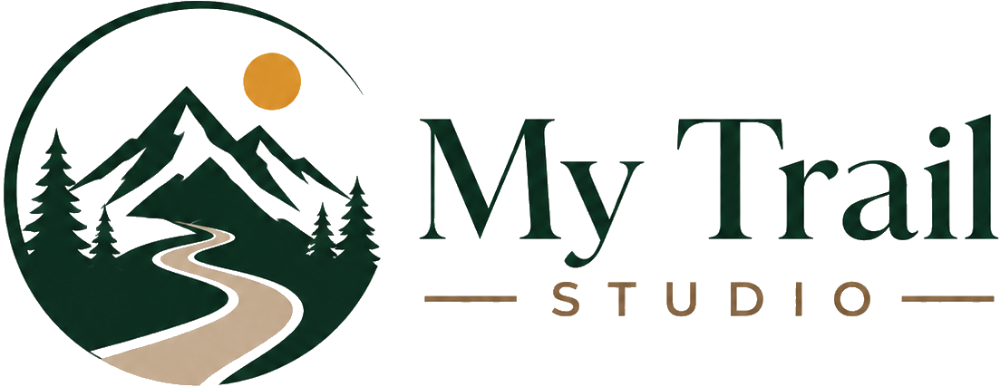

# My Trail Studio

<p align="center">
  
</p>

Motor y capa CLI para crear videos con overlay a partir de videos de camaras de accion y tracks GPX.

El principio central del proyecto es que el GPX manda: define fecha, hora de inicio, hora de fin, duracion base, distancia, altura y datos usados por overlays, timeline y vistas auxiliares.

## Estado Actual

El proyecto tiene dos capas:

- Motor existente por consola: validacion tecnica, generacion de preview y render final.
- Capa `ui_core`: base CLI para el futuro UI visual, con proyectos centralizados, validacion de videos, timeline, export settings, preview, render final y logs.

La UI visual PySide6 todavia no esta implementada. La capa CLI es el backend funcional previo.

## Requerimientos

- Windows.
- Python 3.10 o superior disponible como `python`.
- FFmpeg y FFprobe disponibles en `PATH`.
- Dependencias Python usadas por el motor, incluyendo Pillow.
- Carpeta `resources/font` presente.
- Carpeta `resources/assets` presente con el logo y el isotipo de la aplicacion.
- Videos MP4/MOV con fecha de creacion disponible. Primero se usa `creation_time` de metadata; si falta, se usa la fecha de creacion del archivo.

Verificaciones rapidas:

```powershell
python --version
ffmpeg -version
ffprobe -version
```

## Estructura

```text
<raiz-engine>
  input\
    pipeline_config.json
  output\
  resources\
    assets\
      logo.png
      iso.png
    font\
  scripts\
    validate_pipeline.py
    render_preview.py
    render_final.py
    ...
  ui_core\
    cli.py
    models\
    services\
  run_overlay.ps1
  run_mts_overlay_pipeline.ps1
  run_mts_integral_test.ps1
```

## Instalacion

1. Clona o copia el proyecto.
2. Abre PowerShell en la raiz del engine:

```powershell
cd <raiz-engine>
```

3. Confirma Python y FFmpeg:

```powershell
python --version
ffmpeg -version
ffprobe -version
```

4. Verifica la CLI:

```powershell
.\mts.ps1 --help
```

## Assets de Marca

Los assets de marca de la aplicacion viven en `resources/assets`:

- `logo.png`: logo completo de My Trail Studio para splash screens, headers y documentacion.
- `iso.png`: isotipo compacto para iconos de app, ventana y espacios pequenos de UI.

## Proyectos UI/CLI

Los proyectos no se guardan dentro de `input` ni junto al engine. Se centralizan en:

```text
%APPDATA%\MyTrailStudio\projects\<project-id>
```

Si vienes de una version anterior con otra carpeta de app, los proyectos no se borran. Puedes copiarlos a `%APPDATA%\MyTrailStudio\projects` o usar `--app-data` para apuntar a la carpeta anterior.

Cada proyecto referencia GPX/videos originales sin moverlos. Los subproductos temporales y logs quedan en la carpeta central del proyecto o en la carpeta `output` configurada.

## Flujo Basico

Crear proyecto:

```powershell
.\mts.ps1 create-project --name "Mi Ruta" --gpx "<carpeta-ruta>\track.gpx" --output "<carpeta-ruta>\output"
```

Agregar videos desde carpeta:

```powershell
.\mts.ps1 add-videos-dir --project "<project-id>" --dir "<carpeta-ruta>" --mode hyperlapse --hyperlapse-speed 2.0
```

Si un video no tiene fecha correcta, se puede ajustar manualmente con `set-video-time`.

Validar proyecto:

```powershell
.\mts.ps1 validate-project --project "<project-id>"
```

Configurar exportacion:

```powershell
.\mts.ps1 set-export --project "<project-id>" --resolution 1080p --fps 30 --output-speed 3.5 --remove-audio --single-final-video --transitions --closing --closing-message "Route Completed" --closing-seconds 3
```

O aplicar un preset:

```powershell
.\mts.ps1 list-export-presets
.\mts.ps1 apply-export-preset --project "<project-id>" --preset standard-1080p
```

Generar preview:

```powershell
.\mts.ps1 engine-preview --project "<project-id>" --seconds 10 --quiet
```

Render final:

```powershell
.\mts.ps1 engine-render-final --project "<project-id>" --confirm "RENDER_FINAL" --quiet
```

Resumen:

```powershell
.\mts.ps1 project-summary --project "<project-id>"
```

## Prueba Integral

Sin render final:

```powershell
.\run_mts_integral_test.ps1 -ProjectId "<project-id>"
```

Con render final:

```powershell
.\run_mts_integral_test.ps1 -ProjectId "<project-id>" -RunFinalRender
```

## Salidas

Para el ejemplo:

```text
<carpeta-ruta>\output\previews
<carpeta-ruta>\output\final
<carpeta-ruta>\output\data\manifest.json
```

El render final genera tambien:

```text
render_report.json
render_report.txt
```

## Logs

Los comandos de motor guardan logs en:

```text
%APPDATA%\MyTrailStudio\projects\<project-id>\logs
```

Usa `--quiet` para reducir ruido de consola y conservar detalle en logs.

## Compatibilidad

El flujo original sigue disponible:

```powershell
.\run_overlay.ps1
```

La CLI nueva usa configuracion temporal y no modifica `input/pipeline_config.json` salvo que se haga manualmente.

## Next Steps

1. Preparar UI visual PySide6 sobre `ui_core`.
2. Crear asistente visual: GPX, nombre de ruta, `output` y videos.
3. Crear gestor visual de videos: importacion, estado GPX, hyperlapse, fecha manual.
4. Crear pantalla de exportacion y render con confirmacion.
5. Extraer layout configurable sin romper el layout aprobado actual.


